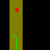

# zoo_baselines
 Implementation of baselines for GrowSpace a new RL benchmark.
 
 Baselines are from stablebaseline3 documentation can be found [here]
 (https://stable-baselines3.readthedocs.io/en/master/index.html), stabebaselines2 [documentation]
 (https://stable-baselines.readthedocs.io/en/master/index.html).

Baselines in this repo for GrowSpace:
* PPO
* DQN
* TRPO

#### Example of GrowSpace with PPO

#### Example of GrowSpace with DQN

#### Example of GrowSpace with TRPO

